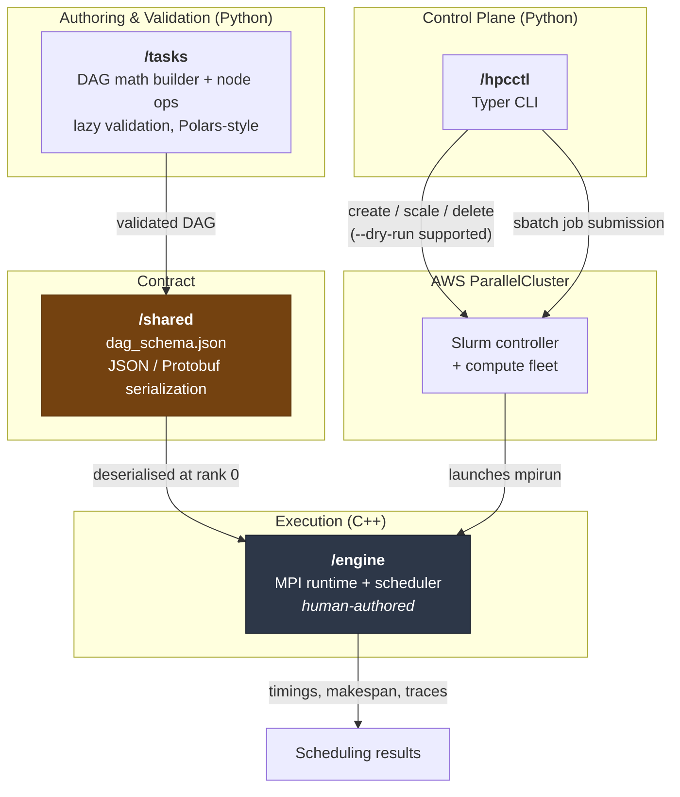

# HPC DAG Scheduler Research Baseline

A research baseline for studying **optimal task scheduling of mathematical Directed Acyclic
Graphs (DAGs) across an HPC cluster** — AWS ParallelCluster, Slurm, and MPI.

---

## Research Problem Statement

Given a mathematical workload expressed as a DAG — matrix products, decompositions,
element-wise kernels, reductions — with data dependencies between nodes, **which scheduling
strategy minimises makespan on a distributed-memory HPC cluster?**

Answering that honestly requires a measurement rig where the scheduler is the only moving
part. The dominant obstacle in practice is not the scheduling theory but the *noise*: garbage
collection pauses, interpreter overhead, dynamic dispatch, and orchestration boilerplate all
contaminate timing data until the effect of the scheduling policy is no longer separable from
the effect of the runtime.

This project therefore enforces a hard separation:

- **Python never executes math.** It *builds*, *validates*, and *serialises* the DAG, and it
  provisions and tears down the cluster. All of this happens before the first MPI rank starts.
- **C++/MPI never handles logic errors.** By the time the engine receives a DAG, every
  shape, rank, acyclicity, and initialisation question has already been answered. The engine
  is free to be a tight, predictable, measurable execution kernel.

The result is that a scheduling experiment varies one thing — the strategy — while the
orchestration cost is pushed entirely outside the measured region.

---

## Architecture Overview



**Data flow:** `/tasks` builds a DAG and validates it eagerly at *build* time → serialises it
against the `/shared` contract → `/hpcctl` provisions the cluster and submits the job →
`/engine` deserialises the DAG and executes it under MPI, emitting scheduling telemetry.

---

## Components

| Path       | Language              | Responsibility                                                                                                  | Ownership                            |
| ---------- | --------------------- | --------------------------------------------------------------------------------------------------------------- | ------------------------------------ |
| `/engine`  | C++ / MPI             | High-performance execution kernel. Deserialises the DAG, applies the scheduling strategy under test, runs the math, emits timings. | **Human-written. Read-only to automated agents.** |
| `/hpcctl`  | Python (Typer, `uv`)  | CLI managing the AWS ParallelCluster lifecycle: create, scale, submit, monitor, delete. Every mutating command supports `--dry-run`. | Python team                          |
| `/tasks`   | Python (NumPy, `uv`)  | DAG math builder, node operations, and concrete task definitions. Performs all logical validation.               | Python team                          |
| `/shared`  | JSON Schema / Protobuf | The serialization contract linking `/tasks` to `/engine`. Single source of truth for the wire format.            | Shared — changes require both sides   |

The `/shared/dag_schema.json` contract defines a DAG document with three required top-level
members: `metadata`, `nodes`, and `outputs`.

---

## Error-Handling Contract

This is the load-bearing convention of the project. The DAG builder is **lazily evaluated**
(construction records intent; nothing computes until the graph is finalised), which means
Python gets to see the whole graph before anything runs — and is therefore obligated to catch
every logical error itself.

### Python (`/tasks`) — build time, always

| Exception                 | Raised when                                                                   |
| ------------------------- | ----------------------------------------------------------------------------- |
| `ShapeMismatchError`      | Operand dimensions do not align for the operation (e.g. `N×M · P×Q` with `M ≠ P`) |
| `DimensionalityError`     | Operation applied to the wrong tensor rank (e.g. cross product on a 2-D matrix) |
| `CyclicDependencyError`   | The graph contains a cycle and is not a valid DAG                              |
| `UninitializedNodeError`  | An `init` node is missing its PRNG seed or shape definition                    |

All four derive from a common `DagBuildError` base, so callers can catch the category or the
specific fault. A DAG that fails any of these checks **must never be serialised**.

### C++ (`/engine`) — runtime physics only

The engine is responsible for conditions that are genuinely undecidable ahead of execution:

- Out of memory (OOM)
- MPI deadlocks and communication failures
- Schema parsing failures (malformed or version-mismatched input)
- Slurm preemption
- NaN / Inf mathematical anomalies

If the engine ever raises a *logical* error, that is a bug in `/tasks`, not in `/engine`.

---

## Setup

Both Python projects use [`uv`](https://docs.astral.sh/uv/) exclusively — for environments,
dependency resolution, and script execution. Do not invoke `pip`, `venv`, or `python` directly.

**Prerequisites:** `uv` (0.8+) and Python 3.11+. `uv` will fetch a suitable interpreter itself
if one is not present.

### `/tasks` — DAG builder library

```bash
cd tasks
uv sync                 # create .venv and install locked dependencies
uv run pytest           # run the test suite
uv run ruff check .     # lint
uv run ruff format .    # format
uv run mypy .           # strict type check
```

### `/hpcctl` — cluster control CLI

```bash
cd hpcctl
uv sync
uv run pytest
uv run ruff check .
uv run ruff format .
uv run mypy .

uv run hpcctl --help    # invoke the CLI
```

### Adding dependencies

```bash
uv add <package>              # runtime dependency
uv add --dev <package>        # development dependency
```

`uv.lock` is committed in both projects and must be kept in sync — commit it alongside any
`pyproject.toml` change.

### Engineering standards

- **Type checking:** `mypy --strict` must pass with zero errors.
- **Docstrings:** every function requires a Google-style docstring (enforced by `ruff`'s
  pydocstyle rules with `convention = "google"`).
- **Line length:** 100 characters.
- **Tests:** `pytest`, with high coverage expected.
- **No side effects:** every AWS-mutating command in `/hpcctl` must implement `--dry-run`,
  printing the intended payload rather than executing it.

The `/engine` directory is built separately with its own C++ toolchain and is authored by
humans; it is not managed by `uv`.

---

## Secrets Hygiene

**Nothing sensitive is ever committed.** No exceptions.

- AWS credentials, SSH keys, and cluster IP addresses are supplied **exclusively through
  environment variables** (or the standard AWS credential chain / SSO), never through
  literals in source, and never through committed config.
- The root `.gitignore` aggressively excludes `.env` files, `*.pem` / `*.key` / `id_rsa*`
  keys, `.aws/` and `credentials` files, and all `*.json` / `*.yaml` / `*.yml` config.
- Deliberate exceptions are un-ignored so the contract and CI remain tracked:
  `/shared/**/*.json`, `/.github/**/*.yml`, and any `*.example.{json,yaml,yml}` template.
  Templates must contain **placeholder values only**.
- `uv.lock` is intentionally tracked; lockfiles are not secrets.

To supply configuration locally, copy a template and fill it in — the copy stays ignored:

```bash
cp cluster.example.yaml cluster.yaml   # cluster.yaml is git-ignored
export AWS_PROFILE=my-research-profile
```

---

## License

See [LICENSE](LICENSE).
