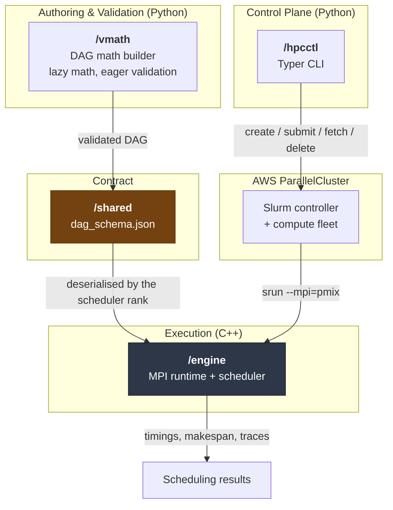

# HPC DAG Scheduler Research Baseline

A research baseline for studying **optimal task scheduling of mathematical Directed Acyclic
Graphs (DAGs) across an HPC cluster** — AWS ParallelCluster, Slurm, and MPI.

## The research problem

> **Judge:** a real Slurm cluster · **Verdict:** wall-clock makespan

You are given:

- A **directed acyclic graph** `G = (V, E)`. Each node is one tensor operation from a fixed
  set of seven primitives (`init`, `add`, `multiply`, `scale`, `mod`, `dot_product`,
  `cross_product`), with known operand shapes and dtype — so its work `cost(v)` (FLOPs) and
  its output size `bytes(v)` are computable *before anything runs*. Each edge `u → v` means
  `v` consumes the tensor `u` produces.
- **`n` identical machines** joined by a network. A machine runs one node at a time. If `u`
  and `v` land on different machines, `bytes(u)` must cross the network before `v` can start;
  on the same machine the hand-off is free.

Produce a **schedule** — a machine assignment and start order for every node that respects
the edges — that **minimises the makespan**: the time at which the last node finishes.

This is classic NP-hard territory (scheduling with precedence and communication delays), so
every practical answer is a heuristic — list scheduling, critical-path/HEFT, locality-greedy,
round-robin, work stealing — and every heuristic has a known failure mode. The
[`/cases`](cases/README.md) suite is the test set: control cases where each naive policy is
*supposed* to win, and adversarial traps built so it measurably loses. What theory abstracts
away — MPI latency, memory bandwidth, dtype throughput — is exactly what this rig measures on
real hardware.

For the measurement to be honest, the scheduler must be the only moving part, so the project
enforces a hard separation:

- **Python never executes math.** It builds, validates, and serialises the DAG, and it
  provisions and tears down the cluster — all before the first MPI rank starts.
- **C++/MPI never handles logic errors.** By the time the engine receives a DAG, every shape,
  rank, acyclicity, and initialisation question is already answered. The engine is a tight,
  measurable execution kernel.

An experiment therefore varies one thing — the strategy — with orchestration cost outside the
measured region.

## Architecture


```mermaid
flowchart TB
    subgraph authoring["Authoring & Validation (Python)"]
        T["<b>/vmath</b><br/>DAG math builder<br/>lazy math, eager validation"]
    end
    subgraph contract["Contract"]
        S["<b>/shared</b><br/>dag_schema.json"]
    end
    subgraph runtime["Execution (C++)"]
        E["<b>/engine</b><br/>MPI runtime + scheduler"]
    end
    subgraph control["Control Plane (Python)"]
        C["<b>/hpcctl</b><br/>Typer CLI"]
    end
    subgraph cloud["AWS ParallelCluster"]
        SL["Slurm controller<br/>+ compute fleet"]
    end

    T -- "validated DAG" --> S
    S -- "deserialised by the scheduler rank" --> E
    C -- "create / submit / fetch / delete" --> SL
    SL -- "srun --mpi=pmix" --> E
    E -- "timings, makespan, traces" --> R["Scheduling results"]

    style E fill:#2d3748,stroke:#1a202c,color:#fff
    style S fill:#744210,stroke:#5f370e,color:#fff
```

| Path | What it is | Read this |
| ---- | ---------- | --------- |
| [`/cases`](cases/README.md) | 28 benchmark DAGs: controls, scheduler traps, real-world shapes, scale extremes | what each case measures, how to read results |
| [`/vmath`](vmath/README.md) | NumPy-flavoured DAG builder: 7 primitive ops, composite math (`sin`, `matpow`, …), eager validation, serialization | how to write the math, all ops, all exceptions |
| [`/hpcctl`](hpcctl/README.md) | Cluster CLI: `boot → deploy → submit → result → destroy` | AWS setup, configuration, lifecycle, design |
| [`/engine`](engine/README.md) | C++/MPI execution kernel (currently a hello-world stand-in) | the engine contract, how to write the MPI app |
| `/shared` | `dag_schema.json` — the wire contract linking `/vmath` to `/engine`; changes need both sides | — |

**Error contract in one line:** `/vmath` raises `ShapeMismatchError`, `DimensionalityError`,
`CyclicDependencyError`, and `UninitializedNodeError` at build time (details in
[`vmath/README.md`](vmath/README.md)); `/engine` handles only runtime physics — OOM, MPI
failures, schema parsing, preemption, NaN/Inf.

## The `hpcctl` lifecycle

One CLI drives the whole experiment loop:

| Command | What it does | Cost clock |
| ------- | ------------ | ---------- |
| `hpcctl boot` | Create the AWS ParallelCluster from `.env` (~15 min) | **$ starts** |
| `hpcctl deploy` | CMake-build the engine locally, rsync it to `/shared` on the cluster | |
| `hpcctl submit <case.py \| dag.json>` | Compile + validate the DAG, ship it, `sbatch` it; prints the job ID | compute scales out per job |
| `hpcctl status` | Cluster state + Slurm queue (`--no-queue` skips SSH) | |
| `hpcctl result <job id>` | Download logs and every file the engine wrote to `./results/<job id>/` | |
| `hpcctl destroy` | Delete the cluster (asks for the name to confirm) | **$ stops** |

Every command takes `--dry-run` to print exactly what it would do — offline and free — and
`HPCCTL_DRY_RUN=1` forces dry-run globally.

## Quickstart

The repository is a [`uv` workspace](https://docs.astral.sh/uv/concepts/workspaces/)
(`hpcctl` and `vmath` share one lockfile and venv at the root), so every command below runs
from the repository root — or any subdirectory. For the cluster — one-time AWS setup
(see [`hpcctl/README.md`](hpcctl/README.md)), then:

```bash
cp hpcctl/.env.example hpcctl/.env && $EDITOR hpcctl/.env   # key pair, subnet, S3 bucket
set -a && . hpcctl/.env && set +a

uv run hpcctl boot                       # create the cluster (~15 min, $ starts)
uv run hpcctl deploy                     # build the engine, ship it to /shared
uv run hpcctl submit cases/wide_skewed_001.py -n 4   # compiles the case, then submits
uv run hpcctl result <job id>            # download outputs to ./results/<job id>/
uv run hpcctl destroy                    # $ stops
```

`deploy` reruns the CMake build before every sync, so a fresh clone needs no manual build
step (`--no-build` ships the existing binaries as-is). `submit` takes a Python case script
(compiled automatically; see [`/cases`](cases/README.md)) or a pre-serialized DAG JSON as its
argument; `-n` picks the instance count (default 1, validated against the queue's
`HPCCTL_MIN_NODES`/`HPCCTL_MAX_NODES` bounds).

Full AWS setup, configuration reference, costs, and design: [`hpcctl/README.md`](hpcctl/README.md).

## Secrets hygiene

Nothing sensitive is ever committed. Credentials, keys, and addresses come exclusively from
environment variables or the AWS credential chain; the root `.gitignore` excludes `.env`,
`*.pem`/key files, and all YAML/JSON config, with narrow exceptions for the `/shared`
contract, CI files, and `*.example.*` templates (placeholders only). Local config lives in
`hpcctl/.env`, copied from the committed `.env.example` and sourced by you — never auto-loaded.

## License

See [LICENSE](LICENSE).
